# Streaming Service App

Streaming Service App is a Java/Spring microservices repository plus a lightweight Node.js frontend used to present the platform as a broadcast-style operations demo.

The repository contains more services than the current cluster demo deploys. The most useful way to approach it is:

- treat `skills/deploy-streaming-app/scripts/deploy-demo.sh` as the canonical full-demo deploy path today
- treat the rest of `services/` as the broader codebase, including services that are still useful for local development, legacy demo flows, or protected load generation

## What The Repo Contains

- Canonical cluster demo slice: PostgreSQL, `content-service`, `media-service`, `user-service`, `billing-service`, `ad-service`, and the `streaming-frontend` gateway/UI.
- Additional business-domain services present in the repo and in the legacy backend demo flow: `customer-service`, `payment-service`, `subscription-service`, and `order-service`.
- Additional service directories not part of the current Kubernetes demo manifests: `config-server`, `discovery-server`, `gateway`, `comments-service`, `moderation-service`, and `notification-service`.
- Demo-focused automation for Kubernetes or OpenShift deployment, Splunk Observability, ThousandEyes, and public or protected load generation.

## Architecture Diagram

```mermaid
flowchart TB
    subgraph Clients["User And Operator Surfaces"]
        Viewer["Viewer Browser<br/>/broadcast"]
        Operator["Operator Browser<br/>/, /#operations, /demo-monkey"]
    end

    subgraph ThousandEyes["ThousandEyes"]
        TESource["Source Enterprise Agent<br/>Ashburn, Virginia, US"]
        TETarget["RTP Target Enterprise Agent<br/>Ashburn, Virginia, US"]
        TECloud["UDP Target Cloud Agent<br/>Singapore"]
        TEHttp["HTTP Tests<br/>broadcast playback + trace map"]
        TEMedia["RTSP / UDP / RTP Tests"]
    end

    subgraph Edge["Frontend Edge"]
        Frontend["streaming-frontend<br/>Node gateway + static UI"]
    end

    subgraph Canonical["Canonical Cluster Demo Slice"]
        Media["media-service-demo<br/>public broadcast, Demo Monkey, trace map"]
        Relay["rtsp-restreamer + MediaMTX<br/>HLS/RTSP relay inside media pod"]
        RtspSvc["media-service-demo-rtsp<br/>public RTSP service"]
        User["user-service-demo<br/>demo auth/session"]
        Content["content-service-demo<br/>catalog"]
        Billing["billing-service<br/>billing APIs"]
        Ad["ad-service-demo<br/>sponsor timing and issues"]
        Postgres["streaming-postgres<br/>PostgreSQL"]
    end

    subgraph Optional["Optional Protected Commerce Services<br/>legacy backend demo or extended protected load"]
        Customer["customer-service-demo"]
        Payment["payment-service-demo"]
        Subscription["subscription-service-demo"]
        Order["order-service-demo"]
    end

    subgraph Splunk["Splunk Observability Cloud"]
        RUM["Browser RUM + Session Replay"]
        APM["APM + Service Map + Demo Dashboards"]
    end

    Viewer --> Frontend
    Operator --> Frontend

    TESource --> TEHttp
    TESource --> TEMedia
    TETarget --> TEMedia
    TECloud -. UDP override .-> TEMedia

    TEHttp --> Frontend
    TEMedia --> RtspSvc

    Frontend --> User
    Frontend --> Content
    Frontend --> Media
    Frontend --> Billing
    Frontend --> Ad
    Frontend -. protected only .-> Customer
    Frontend -. protected only .-> Payment
    Frontend -. protected only .-> Subscription
    Frontend -. protected only .-> Order

    Media --> Relay
    RtspSvc --> Relay
    Media --> User
    Media --> Content
    Media --> Billing
    Media --> Ad

    User --> Postgres
    Content --> Postgres
    Media --> Postgres
    Billing --> Postgres
    Ad --> Postgres
    Customer -. optional .-> Postgres
    Payment -. optional .-> Postgres
    Subscription -. optional .-> Postgres
    Order -. optional .-> Postgres

    Viewer -. browser telemetry .-> RUM
    Operator -. browser telemetry .-> RUM

    Frontend -. Node OTel .-> APM
    Media -. Java OTel .-> APM
    User -. Java OTel .-> APM
    Content -. Java OTel .-> APM
    Billing -. Java OTel .-> APM
    Ad -. Java OTel .-> APM
    Customer -. optional OTel .-> APM
    Payment -. optional OTel .-> APM
    Subscription -. optional OTel .-> APM
    Order -. optional OTel .-> APM

    TEHttp -. connector + dashboards .-> APM
    TEMedia -. connector + dashboards .-> APM
```



Diagram notes:

- The current namespace-safe deploy path includes the `Canonical Cluster Demo Slice`.
- The `Optional Protected Commerce Services` are present in the repo and in the legacy backend demo flow, but they are not part of the canonical skill deploy by default.
- Public playback and the public trace pivot both enter through `streaming-frontend`.
- `media-service-demo` owns the public broadcast path, Demo Monkey state, and the trace-map fanout into `user-service-demo`, `content-service-demo`, `billing-service`, and `ad-service-demo`.

## Technology Stack

- Java 22, Spring Boot 3.3.2, Spring Cloud 2023.0.3
- Node.js, npm, and esbuild for the frontend build
- PostgreSQL with Flyway migrations
- Kafka and Zookeeper
- Redis and MinIO
- MongoDB for parts of the broader service set
- JWT-based auth, Feign clients, Eureka, Config Server, Quartz, and Stripe integration
- Docker Compose for local dependency services
- Kubernetes or OpenShift for the current demo deployment flows
- Splunk Observability Cloud and ThousandEyes for tracing, RUM, dashboards, and synthetic tests

## Start Here

If your immediate goal is to get the demo running in Kubernetes, start with the walkthrough in [`docs/kubernetes-deployment-learning-guide.md`](docs/kubernetes-deployment-learning-guide.md). It is the most explanatory operator-facing guide in this repo for the canonical cluster deployment path.

Create a repo-root `.env` first:

```bash
cp example.env .env
```

The shipped template includes working local backing-service defaults, and the
canonical deploy script now reads that repo-root `.env` automatically.

If you run legacy JVM services directly outside the deploy script, generate the
local auth keys once and then export the values from `.env` into your shell so
Spring can see the database, MinIO, and auth settings:

```bash
bash scripts/local/generate-dev-auth-env.sh
set -a
source .env
set +a
```

Services such as `user-service` still pull their database and JWT settings from
the local config server, so start `config-server` before launching them:

```bash
./mvnw -f services/config-server/pom.xml spring-boot:run
./mvnw -f services/user-service/pom.xml spring-boot:run
```

### Local Dependency Services Only

```bash
docker compose up -d
```

This starts the shared backing services from [`docker-compose.yml`](docker-compose.yml): PostgreSQL, Zipkin, Vault, Kafka, Zookeeper, MailDev, Redis, MinIO, and MongoDB.

It does not boot every Java service in the repo for you.

### Frontend-Only Local Preview

For a static preview of the broadcast UI:

```bash
cd frontend
npm install
npm test
npm run build
python3 -m http.server 8080 -d dist
```

Then open `http://localhost:8080`.

This mode serves built frontend assets only. Protected backend APIs are not proxied here, so the UI falls back to seeded demo content where it can.

See [`frontend/README.md`](frontend/README.md) for the frontend-specific workflow.

### Build Or Test An Individual Service

There is no root Maven aggregator POM in this repository. Build services by pointing the Maven wrapper at the service you want:

```bash
./mvnw -f services/billing-service/pom.xml test
./mvnw -f services/media-service/pom.xml package -DskipTests
```

For the frontend demo scheduling and fallback logic:

```bash
cd frontend
npm test
```

### Canonical Kubernetes Or OpenShift Demo Deployment

Use the skill-backed deploy script by default:

```bash
bash skills/deploy-streaming-app/scripts/deploy-demo.sh \
  --platform kubernetes \
  --namespace streaming-demo
```

Use `--platform openshift` when you want the frontend exposed through an OpenShift Route instead of a standard Kubernetes `LoadBalancer` path.

This namespace-safe deploy flow is the current full-demo entry point. It renders manifests at apply time instead of forcing you to edit checked-in YAML just to change namespaces.

For a step-by-step Kubernetes learning path around this command, including rollout interpretation, access methods, smoke checks, and common failure modes, read [`docs/kubernetes-deployment-learning-guide.md`](docs/kubernetes-deployment-learning-guide.md).

The current demo manifests still compile the Java services inside the cluster.
That means the cluster needs outbound access to Maven repositories, or an
equivalent internal mirror, even when container images are already mirrored.

## Deployment Paths

### Canonical Full-Demo Path

[`skills/deploy-streaming-app/scripts/deploy-demo.sh`](skills/deploy-streaming-app/scripts/deploy-demo.sh)

- Namespace-safe Kubernetes and OpenShift deployment flow
- Deploys PostgreSQL plus the current demo slice: `content-service`, `media-service`, `user-service`, `billing-service`, `ad-service`, and `streaming-frontend`
- Loads the repo-root `.env` automatically when present
- Supports frontend labeling, Route support on OpenShift, and follow-on ThousandEyes and Splunk workflow guidance
- Mirrors into Cursor at [`.cursor/skills/deploy-streaming-app/`](.cursor/skills/deploy-streaming-app/)

### Lower-Level Legacy Split Deploy Scripts

- [`scripts/backend-demo/deploy.sh`](scripts/backend-demo/deploy.sh)
- [`scripts/frontend/deploy.sh`](scripts/frontend/deploy.sh)

These older scripts still work, but they behave differently from the canonical skill flow:

- they apply the checked-in manifests directly in the fixed `streaming-service-app` namespace
- the backend split deploy includes a broader service set than the canonical skill path, including `customer-service`, `payment-service`, `subscription-service`, and `order-service`
- they are useful when you need that older service mix or want lower-level iteration without the namespace-aware skill wrapper

## Repo Layout

- [`frontend/`](frontend/) contains the broadcast-style UI, built static assets, and the Node.js gateway that serves assets and proxies demo APIs
- [`services/`](services/) contains independently buildable Spring Boot services
- [`k8s/`](k8s/) contains the checked-in frontend and backend demo manifests
- [`scripts/`](scripts/) contains deploy helpers, ThousandEyes automation, and load generators
- [`skills/deploy-streaming-app/`](skills/deploy-streaming-app/) contains the repo's Codex skill for full-demo deployment
- [`docs/`](docs/) contains tracing, ThousandEyes, and loadgen walkthroughs
- [`diagrams/`](diagrams/) contains architecture and data-model diagrams

## Common Environment Variables

The full set lives in [`example.env`](example.env). The variables below are the ones most likely to matter first.

### Frontend, Source Maps, And Splunk Observability

- `STREAMING_ENVIRONMENT_LABEL` controls the operator-facing label shown in the broadcast suite
- `SPLUNK_REALM` selects the Splunk Observability realm
- `SPLUNK_RUM_ACCESS_TOKEN` is used by the frontend build, [`scripts/frontend/deploy.sh`](scripts/frontend/deploy.sh), and the canonical deploy path for Browser RUM and source map upload; sourcemap upload is best-effort and warns instead of aborting the deploy when Splunk returns an error
- `SPLUNK_ACCESS_TOKEN` is used by the dashboard sync flow
- `SPLUNK_RUM_APP_NAME` overrides the frontend RUM application name
- `SPLUNK_DEPLOYMENT_ENVIRONMENT` overrides the default deployment environment label
- `SPLUNK_DEMO_DASHBOARD_GROUP_ID` pins dashboard sync to an existing group when automatic matching would be ambiguous
- `SPLUNK_VALIDATION_TOKEN` is only needed when the dashboard-write token cannot read SignalFlow metric data
- `STREAMING_K8S_NAMESPACE` keeps dashboard CPU and infra charts aligned with the deployed namespace
- `STREAMING_PUBLIC_RTSP_URL` overrides the public RTSP URL baked into static frontend builds when you are not letting the deploy script discover it automatically
- `DEMO_AUTH_PASSWORD` pins the demo login password instead of letting the canonical deploy generate one
- `DEMO_AUTH_SECRET` pins the user-service demo signing secret instead of letting the canonical deploy generate one

### PostgreSQL DB Monitoring

- `SPLUNK_DBMON_POSTGRES_ENDPOINT` points the PostgreSQL receiver at the shared demo database service
- `SPLUNK_DBMON_POSTGRES_DATABASES` should stay `streaming` for this repo because the demo services share one database and separate themselves by schema
- `SPLUNK_DBMON_POSTGRES_USERNAME` and `SPLUNK_DBMON_POSTGRES_PASSWORD` are the PostgreSQL credentials the collector will use
- `SPLUNK_DBMON_ACCESS_TOKEN` is the Splunk Observability access token used by the `dbmon` event exporter
- `SPLUNK_DBMON_EVENT_ENDPOINT` is the realm-specific Splunk Observability event endpoint, for example `https://ingest.us1.signalfx.com/v3/event`
- `SPLUNK_DBMON_TLS_INSECURE` matches the receiver TLS setting for demo or lab environments
- `SPLUNK_DBMON_ENABLE_QUERY_SAMPLES` and `SPLUNK_DBMON_ENABLE_TOP_QUERIES` control the PostgreSQL receiver events that feed Database Monitoring
- `SPLUNK_DB_LOGS_ENABLED` is only a prompt flag for the skill; PostgreSQL server log forwarding is not part of the default repo flow

### ThousandEyes Test Creation

- `THOUSANDEYES_BEARER_TOKEN` is required for ThousandEyes API calls
- `THOUSANDEYES_ACCOUNT_GROUP_ID` is recommended for deterministic org selection and is required by dashboard sync
- `TE_SOURCE_AGENT_IDS` supplies the source agent IDs for test creation
- `TE_TARGET_AGENT_ID` is required for the RTP proxy test and acts as the default target for the UDP media-path test
- `TE_UDP_TARGET_AGENT_ID` optionally overrides the UDP media-path target when it should differ from the RTP target
- `TE_RTSP_SERVER` and `TE_RTSP_PORT` are needed for the direct API flow or when the Kubernetes wrapper cannot discover RTSP automatically
- `TE_DEMO_MONKEY_FRONTEND_BASE_URL`, `TE_TRACE_MAP_TEST_URL`, and `TE_BROADCAST_TEST_URL` control the Demo Monkey-sensitive HTTP test targets
- `TE_A2A_THROUGHPUT_MEASUREMENTS=false` is required when the UDP media-path test uses a Cloud Agent endpoint because ThousandEyes rejects UDP throughput measurements in that configuration

Choose the ThousandEyes target mode explicitly before deriving URLs:

- `local` keeps the default `svc.cluster.local` targets for same-network Enterprise Agents
- `external` requires browser-facing or internet-reachable frontend and RTSP targets

## Observability And Synthetic Tests

The main docs are:

- [`docs/kubernetes-deployment-learning-guide.md`](docs/kubernetes-deployment-learning-guide.md)
- [`docs/distributed-tracing.md`](docs/distributed-tracing.md)
- [`docs/postgresql-db-monitoring.md`](docs/postgresql-db-monitoring.md)
- [`docs/thousandeyes-rtsp-api.md`](docs/thousandeyes-rtsp-api.md)

The checked-in collector override for PostgreSQL DB monitoring lives at:

- [`k8s/otel-splunk/postgresql-dbmon.values.yaml`](k8s/otel-splunk/postgresql-dbmon.values.yaml)

The main scripts are:

- [`scripts/thousandeyes/create-rtsp-tests.sh`](scripts/thousandeyes/create-rtsp-tests.sh) for direct ThousandEyes API workflows
- [`scripts/thousandeyes/deploy-k8s-rtsp-tests.sh`](scripts/thousandeyes/deploy-k8s-rtsp-tests.sh) for the in-cluster Kubernetes Job wrapper
- [`scripts/thousandeyes/create-demo-dashboards.py`](scripts/thousandeyes/create-demo-dashboards.py) for Splunk Observability dashboard sync
- [`skills/deploy-streaming-app/tests/postgresql-db-monitoring-config.test.sh`](skills/deploy-streaming-app/tests/postgresql-db-monitoring-config.test.sh) for repo-side DB monitoring config validation
- [`skills/deploy-streaming-app/tests/postgresql-db-monitoring-live-smoke.test.sh`](skills/deploy-streaming-app/tests/postgresql-db-monitoring-live-smoke.test.sh) for a live cluster smoke test of the collector and PostgreSQL path

Important behavior:

- PostgreSQL DB monitoring belongs on the Splunk OTel Collector `clusterReceiver`, not the `agent` DaemonSet, so the shared database is scraped once instead of once per node.
- The checked-in DBMON overlay uses dedicated `metrics/dbmon` and `logs/dbmon` pipelines so it can layer on top of the chart defaults without replacing the main `metrics` receiver list.
- The current demo deploy uses one PostgreSQL database named `streaming` and multiple schemas, so the receiver `databases` list should target `streaming`, not `demo_content`, `billing`, or the other schema names.
- PostgreSQL server logs are optional and intentionally out of the default repo flow unless you also have Splunk Platform access and choose to design that path.
- The direct ThousandEyes helper can use the token's default account group when `THOUSANDEYES_ACCOUNT_GROUP_ID` is omitted, but dashboard sync requires both `THOUSANDEYES_BEARER_TOKEN` and `THOUSANDEYES_ACCOUNT_GROUP_ID`.
- Use `THOUSANDEYES_JOB_ACTION=create-demo-monkey-http` when you only want the two Demo Monkey-sensitive HTTP tests.
- If the UDP media-path test uses a Cloud Agent endpoint, set `TE_A2A_THROUGHPUT_MEASUREMENTS=false`.
- The RTP dashboard only populates when an enabled ThousandEyes OTel metric stream includes the RTP test through `testMatch` or exports the `voice` test type.
- Dashboard sync supports `--skip-te-metric-validation` when you need to bypass the post-sync SignalFlow data check.

Example dashboard sync:

```bash
python3 scripts/thousandeyes/create-demo-dashboards.py
```

## Load Generators

### Public Broadcast Load

- Script: [`scripts/loadgen/broadcast-loadgen.mjs`](scripts/loadgen/broadcast-loadgen.mjs)
- Kubernetes wrapper: [`scripts/loadgen/deploy-k8s-broadcast-loadgen.sh`](scripts/loadgen/deploy-k8s-broadcast-loadgen.sh)
- Docs: [`docs/broadcast-loadgen.md`](docs/broadcast-loadgen.md)

This workload targets the public broadcast page, status API, HLS manifests, segments, and optional trace-map pivots. It supports one-shot `Job` mode and recurring `CronJob` mode in Kubernetes.

### Protected Operator, Billing, And Commerce Load

- Script: [`scripts/loadgen/operator-billing-loadgen.mjs`](scripts/loadgen/operator-billing-loadgen.mjs)
- Kubernetes wrapper: [`scripts/loadgen/deploy-k8s-operator-billing-loadgen.sh`](scripts/loadgen/deploy-k8s-operator-billing-loadgen.sh)
- Docs: [`docs/operator-billing-loadgen.md`](docs/operator-billing-loadgen.md)

This workload expects the broader protected service set to be reachable through the frontend, including `customer-service`, `payment-service`, `subscription-service`, and `order-service`.

The canonical skill deploy path does not deploy those services today. If you want the full protected commerce workload, use the legacy backend demo deploy path or otherwise make those upstream services reachable in the namespace behind `streaming-frontend`.

## Diagrams And Demo Material

- [`diagrams/`](diagrams/) contains architecture and data-model visuals
- [`demo-operator-runbook.md`](demo-operator-runbook.md) and [`demo-script.md`](demo-script.md) capture live demo flow notes
- [`DEMO_LIBRARY_SOURCES.md`](DEMO_LIBRARY_SOURCES.md) documents the seeded demo media set

## License

This project is distributed under the MIT License. See [`LICENSE`](LICENSE).
