# Streaming Service App Demo Script

This script is written for the current demo stack in this repo. It stays close to the actual application, the current ThousandEyes tests, and the numbered Splunk Observability dashboards so the presenter is not inventing a story that the product surfaces do not support.

## Demo In One Sentence

Start with the public broadcast experience, move into the protected control room, use ThousandEyes for outside-in baseline and path context, then use Splunk Observability Cloud to explain why the application or media workflow behaved that way.

## The Surfaces In This Demo

- `/broadcast`
  The public viewer page. It shows the live HLS player, service state, sponsor pod timing, ad mode, and the direct playback URL.
- `/`
  The protected Acme Broadcasting operator suite. Use the launch overlay to open the viewer path, operator path, or exec path without manual credentials.
- `/#operations`
  Master Control. This is the best protected view for sponsor timing, queue posture, broadcast status, and incident context.
- `/demo-monkey`
  Incident Simulation Console. Use this to arm the exact fault preset that matches the story you want to tell.
- `/api/v1/demo/public/trace-map`
  The public trace pivot. This enters through `streaming-frontend`, reaches `media-service-demo`, and fans out to `user-service-demo`, `content-service-demo`, `billing-service`, and `ad-service-demo`.

## Architecture Diagram

```mermaid
flowchart TB
    subgraph Clients["User And Operator Surfaces"]
        Viewer["Viewer Browser<br/>/broadcast"]
        Operator["Operator Browser<br/>/, /#operations, /demo-monkey"]
    end

    subgraph ThousandEyes["ThousandEyes"]
        TEHttp["HTTP Tests<br/>broadcast playback + trace map"]
        TEMedia["RTSP / UDP / RTP Tests"]
    end

    subgraph Edge["Frontend Edge"]
        Frontend["streaming-frontend<br/>Node gateway + static UI"]
    end

    subgraph Canonical["Canonical Cluster Demo Slice"]
        Media["media-service-demo<br/>public broadcast, Demo Monkey, trace map"]
        Relay["rtsp-restreamer + MediaMTX<br/>HLS/RTSP relay inside media pod"]
        RtspSvc["media-service-demo-rtsp<br/>public RTSP service"]
        User["user-service-demo<br/>demo auth/session"]
        Content["content-service-demo<br/>catalog"]
        Billing["billing-service<br/>billing APIs"]
        Ad["ad-service-demo<br/>sponsor timing and issues"]
        Postgres["streaming-postgres<br/>PostgreSQL"]
    end

    subgraph Optional["Optional Protected Commerce Services<br/>legacy backend demo or extended protected load"]
        Customer["customer-service-demo"]
        Payment["payment-service-demo"]
        Subscription["subscription-service-demo"]
        Order["order-service-demo"]
    end

    subgraph Splunk["Splunk Observability Cloud"]
        RUM["Browser RUM + Session Replay"]
        APM["APM + Service Map + Demo Dashboards"]
    end

    Viewer --> Frontend
    Operator --> Frontend

    TEHttp --> Frontend
    TEMedia --> RtspSvc

    Frontend --> User
    Frontend --> Content
    Frontend --> Media
    Frontend --> Billing
    Frontend --> Ad
    Frontend -. protected only .-> Customer
    Frontend -. protected only .-> Payment
    Frontend -. protected only .-> Subscription
    Frontend -. protected only .-> Order

    Media --> Relay
    RtspSvc --> Relay
    Media --> User
    Media --> Content
    Media --> Billing
    Media --> Ad

    User --> Postgres
    Content --> Postgres
    Media --> Postgres
    Billing --> Postgres
    Ad --> Postgres
    Customer -. optional .-> Postgres
    Payment -. optional .-> Postgres
    Subscription -. optional .-> Postgres
    Order -. optional .-> Postgres

    Viewer -. browser telemetry .-> RUM
    Operator -. browser telemetry .-> RUM

    Frontend -. Node OTel .-> APM
    Media -. Java OTel .-> APM
    User -. Java OTel .-> APM
    Content -. Java OTel .-> APM
    Billing -. Java OTel .-> APM
    Ad -. Java OTel .-> APM
    Customer -. optional OTel .-> APM
    Payment -. optional OTel .-> APM
    Subscription -. optional OTel .-> APM
    Order -. optional OTel .-> APM

    TEHttp -. connector + dashboards .-> APM
    TEMedia -. connector + dashboards .-> APM
```

Diagram notes:

- The current namespace-safe deploy path includes the `Canonical Cluster Demo Slice`.
- The `Optional Protected Commerce Services` are present in the repo and in the legacy backend demo flow, but they are not part of the canonical skill deploy by default.
- Public playback and the public trace pivot both enter through `streaming-frontend`.
- `media-service-demo` owns the public broadcast path, Demo Monkey state, and the trace-map fanout into `user-service-demo`, `content-service-demo`, `billing-service`, and `ad-service-demo`.

## What ThousandEyes And Splunk Should Show

ThousandEyes in this repo is not generic. The demo uses specific configured tests. The names below match the current `.env` defaults, so if your booth renamed them, swap in the values from `TE_RTSP_TCP_TEST_NAME`, `TE_UDP_MEDIA_TEST_NAME`, `TE_RTP_STREAM_TEST_NAME`, `TE_TRACE_MAP_TEST_NAME`, and `TE_BROADCAST_TEST_NAME`.

- `aleccham-broadcast-playback`
  HTTP server test for `/api/v1/demo/public/broadcast/live/index.m3u8`. This is the outside-in viewer baseline for the public HLS playback path. Use it first when the story is playback failure, startup delay, or public-channel instability.
- `aleccham-broadcast-trace-map`
  HTTP server test for `/api/v1/demo/public/trace-map`. This is the outside-in application pivot for the public trace fanout. Use it when you want ThousandEyes to prove the request path into `streaming-frontend`, `media-service-demo`, and the backend dependency chain.
- `RTSP-TCP-8554`
  RTSP control-path visibility for the public RTSP service on `TCP/8554`. This proves reachability and path health to the control endpoint, but it does not tell the audience whether the actual RTP stream quality is good.
- `UDP-Media-Path`
  UDP transport-path visibility between ThousandEyes agents. This is the deeper media-transport proof for packet delivery and path posture when the room wants to see whether the network path is behaving differently from the application path.
- `RTP-Stream-Proxy`
  RTP proxy quality visibility through the ThousandEyes voice test model. Use this when you need loss, jitter, and delay evidence for the media story, especially if the audience wants to talk about degraded transport quality instead of broken application logic.

Quick presenter mapping:

- Start with `aleccham-broadcast-playback` when the audience cares about what the viewer felt.
- Add `aleccham-broadcast-trace-map` when you need to prove the public request path and application fanout.
- Bring in `RTSP-TCP-8554` when someone asks whether the RTSP control endpoint was reachable at all.
- Bring in `UDP-Media-Path` and `RTP-Stream-Proxy` when the room shifts from application timing to media transport quality.

Splunk Observability is also organized for the walkthrough. The current dashboard order is:

1. `01 Start Here: Network Symptoms`
2. `02 Pivot: User Impact To Root Cause`
3. `03 Backend Critical Path`
4. `04 Deep Dive: Trace Map Path`
5. `05 Deep Dive: Broadcast Playback Path`
6. `06 Deep Dive: RTP Media Quality`

Browser RUM is active on the public and protected frontend. The Kubernetes frontend is instrumented as `streaming-frontend`, so Splunk APM should show the gateway service before the Java backends.

## Core Story

The application already gives you a believable broadcaster workflow:

- The public channel rotates the house lineup until a contribution feed is taken live.
- Sponsor pods are queued into that lineup roughly every three minutes.
- The operator suite shows the same event from the control-room side.
- Demo Monkey can delay the sponsor break, miss the sponsor pod, slow startup, inject browser failures, or degrade the trace pivot.
- Load generators can create both public viewer traffic and protected operator traffic so the dashboards look earned instead of staged.

That means the cleanest story is not a random outage. It is a live broadcast with audience traffic, sponsor timing, and a fault that lands at exactly the wrong moment.

## Recommended Primary Demo

Use `ad-break-delay` as the default story.

Why this works:

- It is visible on the public broadcast page.
- It is easy to explain in Master Control.
- It ties viewer experience to monetization.
- It lands cleanly in Splunk APM and Browser RUM.
- It does not require you to claim a network outage when the issue is really in the application path.

Use `one-break-sponsor-miss` when you want a safer single-break failure that auto-clears. Use `sponsor-pod-miss` when you want the harder persistent failure.

## Primary Walkthrough

### 1. Start On The Public Broadcast

Open `/broadcast`.

What to point out:

- `Acme Network East` is the public-facing channel.
- The page shows `Service state`, `Sponsor pod`, `Ad mode`, and the `Transport URL`.
- The channel is running the house loop until an RTSP contribution is taken live.

Talk track:

`This is the same public surface a viewer, sponsor monitor, or transport-check workflow would see. The important thing is that we already know what is on air and when the next sponsor pod should land.`

### 2. Step Into The Control Room

Open `/`, use the operator persona, and land on `/#operations`.

What to point out:

- The protected suite mirrors the public story from the operator side.
- Command Center and Master Control show lineup, queue posture, sponsor readiness, and service posture.
- The sponsor timing you saw on `/broadcast` is visible here too, so the demo is not jumping between unrelated screens.

Talk track:

`Now we are looking at the same event from inside the control room. The public page shows impact. The operator suite shows the queue, the sponsor timing, and the control surface behind it.`

### 3. Set Up The "Why Now?"

Explain that the environment is under realistic traffic:

- The broadcast load generator hits `/broadcast`, `/api/v1/demo/public/broadcast/current`, the live HLS manifests and segments, and a smaller amount of `/api/v1/demo/public/trace-map`.
- The protected load generator signs in through the persona shortcut and warms Accounts, Payments, Commerce, billing events, RTSP job creation, and order lifecycle activity.
- For the standard sponsor-break walkthrough, keep `LOADGEN_OPERATOR_TAKE_LIVE_RATIO=0` so the warm-up traffic does not unexpectedly switch the public channel to a contribution feed.

Talk track:

`We are not clicking a dead demo. Viewer traffic is already moving through the public path, and protected operators are also active in the suite.`

### 4. Establish The ThousandEyes Baseline

Start in ThousandEyes with the two HTTP tests that matter most to this demo:

- `aleccham-broadcast-playback`
- `aleccham-broadcast-trace-map`

What to say:

- Playback gives you the outside-in baseline for the public path.
- Trace map gives you the path into the application dependency fanout.
- Playback and trace map are the two tests most likely to move during sponsor-delay, slow-start, playback, or Demo Monkey HTTP faults because they hit the public frontend-backed paths directly.
- If the audience asks about media transport, keep `RTSP-TCP-8554`, `UDP-Media-Path`, and `RTP-Stream-Proxy` ready as the deeper media-path proof.
- `RTSP-TCP-8554` answers `could the agent reach the public RTSP control endpoint`, while `UDP-Media-Path` and `RTP-Stream-Proxy` answer `was the transport path or media quality degraded`.
- For the sponsor-delay story, ThousandEyes is the supporting path view. Splunk APM is still the main diagnosis pivot once the break starts slipping.

Talk track:

`ThousandEyes gives us the outside-in baseline before we change anything. If this turns into a network-first story, we stay here longer. If it turns into a sponsor-workflow story, we use this as supporting path context and pivot into Splunk APM.`

### 5. Arm The Fault In Demo Monkey

Open `/demo-monkey` and apply `ad-break-delay`.

What the preset actually does:

- It slows ad decisioning for the queued sponsor break.
- The public broadcast page should show a short stall before the sponsor starts.
- The control room still shows the queued sponsor metadata, so the presenter can connect viewer impact to the missed timing window.
- Arm it when the UI shows the next sponsor pod is close. The public and protected surfaces expose the upcoming `breakStartAt`, and the house loop inserts sponsor pods on roughly three-minute boundaries, so arming too early creates dead time instead of a crisp incident.

The console already tells you how to pivot:

- Story headline: sponsor break is delayed
- Pivot: `Control room then Splunk APM`
- Revenue angle: sponsor timing is slipping

Talk track:

`We did not break the whole channel. We made the sponsor handoff late. That is a much stronger demo because the viewer feels it and the revenue story is obvious immediately.`

### 6. Confirm The Symptom In The Application

Return to `/broadcast` and `/#operations`.

What to show:

- The next sponsor pod is close enough that the audience can watch the fault land without waiting through a full loop.
- The public player feels the stall at the break boundary.
- The sponsor pod is still queued or visibly unstable.
- Master Control confirms the same sponsor and break window from the operator view.

Talk track:

`Now the audience can see the symptom on the viewer surface and the same break timing on the operator surface. This gives us permission to pivot into the observability tools.`

### 7. Move Into Splunk Observability Cloud

Use the numbered dashboards with this order for the sponsor-delay story:

1. `02 Pivot: User Impact To Root Cause`
   Show the common time window where viewer impact and backend pressure line up.
2. `03 Backend Critical Path`
   This is the main application view for the sponsor-delay story.
3. `01 Start Here: Network Symptoms`
   Use this only when you want to reconnect the application finding to ThousandEyes and the shared timeline.

What to point out in APM:

- `streaming-frontend` should be the entry service.
- `media-service-demo` owns the public trace pivot and broadcast orchestration.
- The trace map flow fans out to `user-service-demo`, `content-service-demo`, `billing-service`, and `ad-service-demo`.
- For a sponsor-delay story, keep the presenter focused on `media-service-demo` and `ad-service-demo` first.

Talk track:

`ThousandEyes showed us where the symptom showed up. Splunk is showing us why the sponsor handoff was late and which part of the application consumed the latency budget.`

### 8. Use Browser RUM To Reconnect To The Viewer

Open Browser RUM for the `/broadcast` surface after APM.

Why:

- It proves the public page actually degraded.
- It reinforces that the viewer saw the same bad moment the operator saw.
- It keeps the story anchored in experience, not just service internals.

Talk track:

`This is the same problem from the browser side. We are not just looking at server spans. We can see that the public viewer surface really degraded at the sponsor boundary.`

### 9. Close Simply

Close with the same structure every time:

- The public application showed the symptom.
- ThousandEyes gave the outside-in baseline and path context for the public flow.
- Splunk showed why the workflow fell behind.
- The operator suite showed the business impact in sponsor timing and channel control.

## Scenario-To-Tool Map

Use this when you need to change course mid-demo.

| Scenario | Start Here | Application Proof | Splunk Landing Zone |
| --- | --- | --- | --- |
| `ad-break-delay` | `/broadcast` or `/#operations` | queued sponsor break stalls but still exists | dashboards `02` and `03`, then APM |
| `one-break-sponsor-miss` | `/broadcast` | one sponsor break misses and then auto-clears | dashboard `03`, Browser RUM, then dashboard `05` if playback detail matters |
| `sponsor-pod-miss` | `/broadcast` | sponsor clip fails at the break boundary | dashboard `03`, APM, Browser RUM |
| `viewer-startup-spike`, `viewer-brownout`, `packet-loss` | ThousandEyes | public stream starts slowly or drops | dashboard `01`, then `02`, then APM if needed |
| `dependency-timeout`, `service-specific-failure`, `trace-map-outage` | `/api/v1/demo/public/trace-map` and ThousandEyes | public trace pivot degrades without taking down everything else | dashboard `04`, then APM service map |
| `frontend-crash` | Browser RUM | viewer page throws a client-side exception | Browser RUM first, then APM if the crash also exposed a backend problem |

## Optional RTSP And Media-Path Deep Dive

If the audience wants the media transport story, use the operator suite RTSP workflow after the main demo, not before it.

What to show:

- An RTSP job in the protected suite
- Taking the contribution live into the external channel
- The public channel switching from the house loop to the contribution

Then use:

- ThousandEyes `RTSP-TCP-8554` for control-path visibility
- ThousandEyes `UDP-Media-Path` for transport-path visibility
- ThousandEyes `RTP-Stream-Proxy` for RTP quality visibility
- Splunk dashboards `05 Deep Dive: Broadcast Playback Path` and `06 Deep Dive: RTP Media Quality`

This keeps the main booth story simple while still giving a credible deeper path for a media or broadcast engineer.

## Short Version

`We start on the public broadcast page, where the viewer can already see channel state and sponsor timing. We move into the operator suite to show the same break from the control-room side, and then we arm a targeted sponsor-delay fault in Demo Monkey just ahead of the next pod boundary. ThousandEyes gives us the outside-in baseline and path context, and Splunk Observability Cloud shows why the application and sponsor workflow fell behind. The result is one connected story across the application, ThousandEyes, Splunk APM, Browser RUM, and the operator workflow.`
