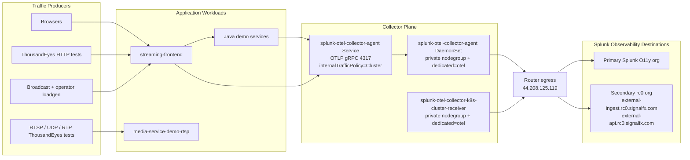

# 09. Splunk OTel Traffic Architecture

This guide documents the traffic model that actually worked in the `streaming-eks-delay-demo` environment, including the rc0 secondary export path.

The key design choice is that app workloads and collector egress do not live on the same node class:

- app pods can run on the normal worker nodes
- the Splunk OTel Collector runs on the private `otel` nodegroup
- collector egress leaves through the router Elastic IP `44.208.125.119`

That split is intentional. It gives the collector one stable source IP for Splunk allowlisting without forcing the whole app onto the private nodegroup.

## Architecture Diagram

The Mermaid diagram below focuses on traffic direction, not Kubernetes object ownership.



## What Each Path Does

### 1. User, loadgen, and ThousandEyes request traffic

- Browsers, the broadcast loadgen, and the operator loadgen all hit `streaming-frontend`.
- The HTTP ThousandEyes tests also hit `streaming-frontend`.
- The RTSP, UDP, and RTP ThousandEyes tests hit the media path directly through `media-service-demo-rtsp`.

Only the HTTP ThousandEyes tests create APM traces. The RTSP, UDP, and RTP tests are still useful for network visibility, but they do not create application spans by themselves.

### 2. App traces into the collector

The repo's Java and Node.js auto-instrumentation path expects:

- `OTEL_EXPORTER_OTLP_PROTOCOL=grpc`
- `OTEL_EXPORTER_OTLP_ENDPOINT=http://splunk-otel-collector-agent.otel-splunk.svc.cluster.local:4317`

`4317` matters here. The agent service is used as a cluster-wide OTLP gRPC entry point for app pods.

### 3. Why `internalTrafficPolicy=Cluster` matters

The collector agents run only on the private `otel` nodes so their outbound traffic stays on the router path.

That means app pods on the normal worker nodes are often talking to a Service whose backing pods are on different nodes. With the chart default `internalTrafficPolicy=Local`, those app pods can fail to reach the collector even though the collector itself is healthy.

The repo therefore treats this as part of the required collector shape:

- `splunk-otel-collector-agent` must use `internalTrafficPolicy=Cluster`
- the helper enforces that with a Helm post-renderer and then rechecks the live Service because chart `0.149.0` hardcodes `Local`

### 4. Collector egress to Splunk

Collector outbound traffic is intentionally centralized:

- `splunk-otel-collector-agent` exports traces, metrics, and entities
- `splunk-otel-collector-k8s-cluster-receiver` exports cluster metrics and metadata
- both leave from the private nodegroup
- private subnet egress goes through the router EIP `44.208.125.119`

That is the IP to allowlist when Splunk needs one stable source address from this cluster.

### 5. Secondary rc0 export

The secondary org is not a normal realm-only configuration.

The working rc0 path used:

- `SPLUNK_OTEL_SECONDARY_REALM=rc0`
- `SPLUNK_OTEL_SECONDARY_INGEST_URL=https://external-ingest.rc0.signalfx.com`
- `SPLUNK_OTEL_SECONDARY_API_URL=https://external-api.rc0.signalfx.com`

The repo overlays [`k8s/otel-splunk/collector.secondary-o11y.values.yaml`](../k8s/otel-splunk/collector.secondary-o11y.values.yaml) when both `SPLUNK_OTEL_SECONDARY_REALM` and `SPLUNK_OTEL_SECONDARY_ACCESS_TOKEN` are set.

## What Broke And What It Looked Like

### OTLP protocol and port mismatch

The app pods were configured with `OTEL_EXPORTER_OTLP_PROTOCOL=grpc`, but the working agent path is `4317`, not `4318`.

Symptoms:

- infrastructure metrics still showed up
- APM spans did not
- collector logs did not show app spans being accepted

### Agent service traffic policy drift

The chart installed the agent Service with `internalTrafficPolicy=Local` while the DaemonSet was pinned to the private `otel` nodes.

Symptoms:

- app pods on public workers timed out connecting to the agent Service
- private-node test pods could still connect
- collector health looked normal even while app traces were missing

### Environment tag mismatch

Collector-side telemetry uses `SPLUNK_DEPLOYMENT_ENVIRONMENT`, and the repo deploy scripts now render that same value into `deployment.environment` for the app manifests.

Symptoms:

- direct `kubectl apply` of the checked-in manifests without the repo scripts can still leave traces under the default `deployment.environment=streaming-app`
- scripted deploys keep infra and APM aligned on the same environment label

### Sparse synthetic traffic

The HTTP ThousandEyes tests do generate spans, but at a low rate. They are useful as proof that the path works, not as heavy trace generation.

The recurring load generators are much better when you want obvious APM volume.

## Validation Checklist

Use these checks after changing the collector, token, or allowlist setup.

### Canonical live smoke

Use the repo smoke test first:

```bash
bash skills/deploy-streaming-app/tests/splunk-otel-tracing-live-smoke.test.sh
```

It verifies the collector shape, generates `trace-map` traffic, checks accepted and exported span counters on every agent pod, and fails on recent exporter error patterns. If the app namespace is not the repo default, override `APP_NAMESPACE`.

### Collector placement

Confirm the collector is still on the private nodegroup:

```bash
kubectl -n otel-splunk get pods -o wide
```

### Agent Service routing

Confirm the Service still routes cluster-wide:

```bash
kubectl -n otel-splunk get svc splunk-otel-collector-agent \
  -o jsonpath='{.spec.internalTrafficPolicy}'
```

Expected output:

```text
Cluster
```

### App pod reachability to OTLP gRPC

From an app pod on a normal worker node, test the Service on `4317`:

```bash
kubectl -n streaming-demo exec deploy/streaming-frontend -- \
  node -e "const net=require('net');const s=net.connect(4317,'splunk-otel-collector-agent.otel-splunk.svc.cluster.local');s.on('connect',()=>{console.log('connected');s.end();process.exit(0)});s.on('error',(e)=>{console.error(e.message);process.exit(1)});setTimeout(()=>{console.error('timeout');process.exit(2)},5000)"
```

### Egress IP from the collector path

Launch a short-lived pod on the private `otel` nodegroup and confirm the public IP:

```bash
kubectl -n otel-splunk run egress-check \
  --rm -it --restart=Never \
  --image=curlimages/curl \
  --overrides='{"spec":{"nodeSelector":{"eks.amazonaws.com/nodegroup":"private"},"tolerations":[{"key":"dedicated","operator":"Equal","value":"otel","effect":"NoSchedule"}]}}' \
  -- curl -s https://checkip.amazonaws.com
```

Expected output:

```text
44.208.125.119
```

### Collector self-metrics for spans

Check the agent telemetry for both accepted and exported spans:

- `otelcol_receiver_accepted_spans`
- `otelcol_exporter_sent_spans{exporter="signalfx"}`
- `otelcol_exporter_sent_spans{exporter="signalfx/secondary"}`

If accepted spans stay at zero, the problem is still between the app pods and the collector. If accepted spans rise but secondary exported spans do not, the problem is downstream of the collector.

## Operator Notes

### Duo SSO and local `kubectl`

`duo-sso` fixes AWS authentication. It does not fix local TLS interception on the path to the EKS API.

If `kubectl` still fails after a successful `duo-sso`, re-check:

- whether the laptop public IP is allowlisted on the EKS endpoint as `/32`
- whether corporate VPN or Cisco Secure Access is intercepting the EKS TLS path

### rc0 API reads are separate from rc0 ingest

A token that can ingest into rc0 is not automatically proven to work for rc0 read or query APIs. Treat ingest validation and API-query validation as separate checks.
